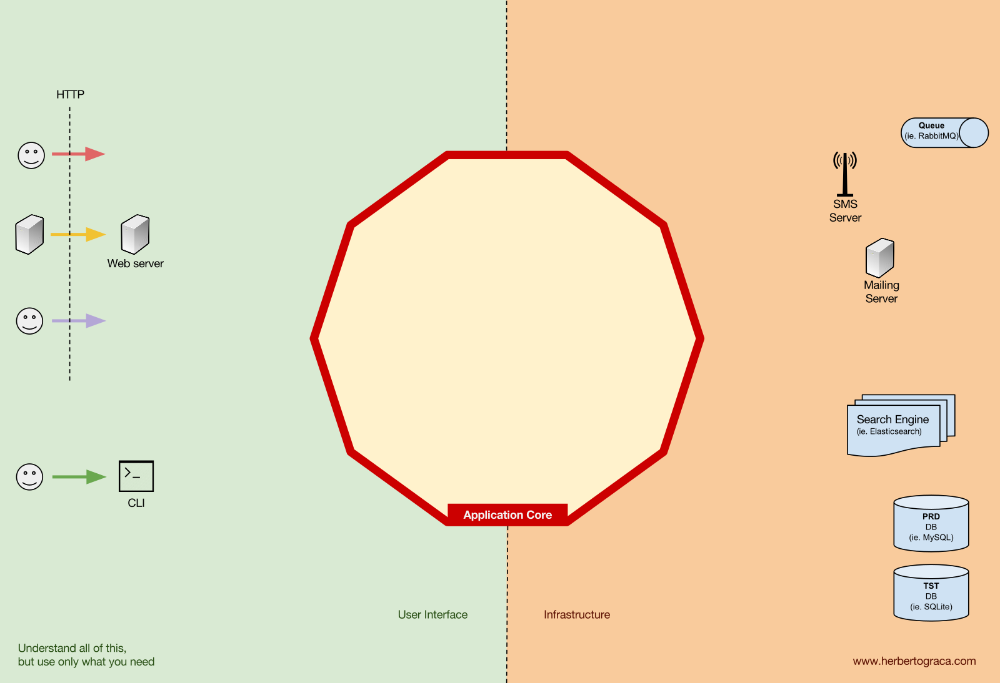
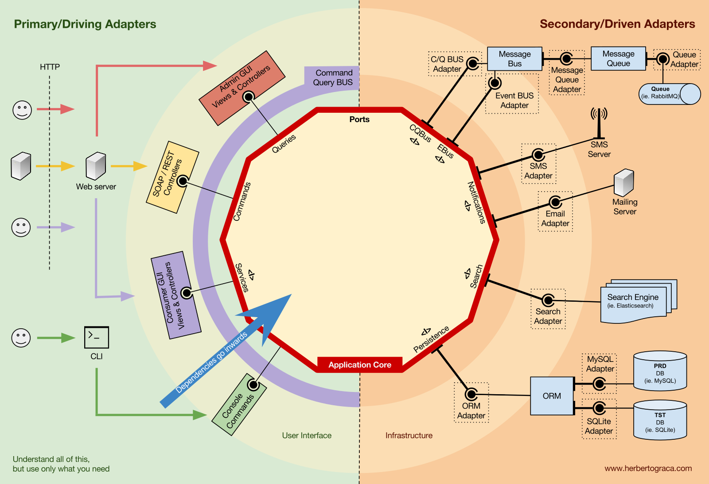

# Microserviços conectados via eventos com Quarkus e Kafka

## Referências

* (Bom conteúdo e Boas ilustrações) - https://herbertograca.com/2017/11/16/explicit-architecture-01-ddd-hexagonal-onion-clean-cqrs-how-i-put-it-all-together/

* Spring Hexagonal - Boas ilustrações: https://reflectoring.io/spring-hexagonal/

* https://vaadin.com/learn/tutorials/ddd/ddd_and_hexagonal
